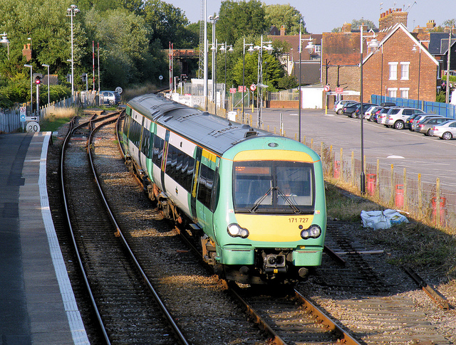
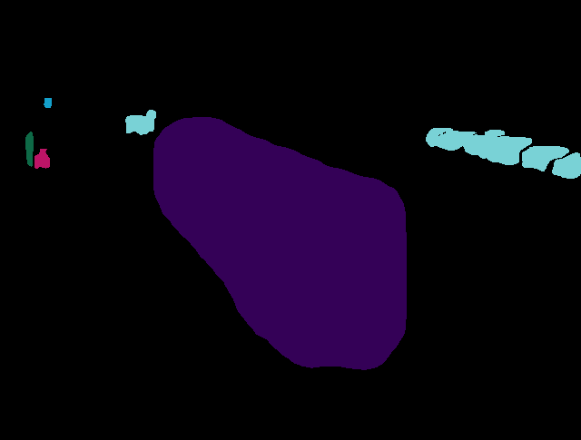
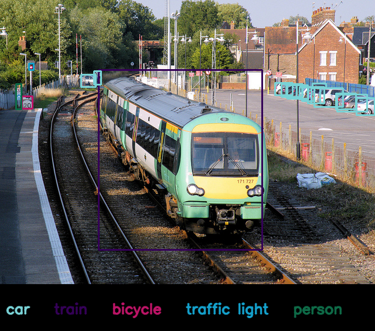

<!-- ```markdown -->
# Image Captioning and Segmentation

<!--   Optional: Add a logo if you have -->

This project is an **AI-powered system** that performs both **image captioning** and **semantic segmentation** on uploaded images. It combines **transformer-based captioning** and **Mask R-CNN segmentation** to generate descriptive captions, segment masks, and bounding boxes for the most prominent objects in an image. The system is hosted via **FastAPI** and has a **web interface** using HTML.

---

## Features

- **Image Upload**: Upload any JPG image via the web interface.
- **Image Captioning**: Generates a descriptive caption for the uploaded image using a trained transformer-based captioning model.
- **Semantic Segmentation**: Detects and segments objects in the image, showing colored masks.
- **Bounding Boxes**: Highlights the top detected objects with bounding boxes.
- **Web UI**: Interactive interface with side-by-side results.
- **FastAPI Backend**: Serves the models and handles requests efficiently.
- **Supports GPU**: Runs on CUDA if available for faster inference.

---

## Demo

After running the project, you can access the UI at:

```

http://127.0.0.1:8000

```

Upload an image and see:

1. **Original Image**
2. **Colored Segmentation Mask**
3. **Bounding Box Image**
4. **Generated Caption**
5. **Detected Objects**

---

## Project Structure

```

Image-Captioning-and-Segmentation/
│
├── app.py                   # FastAPI backend for hosting (optional)
├── main_model_training.py   # Main script used for training
├── test_cap_model.py        # Captioning model class and inference functions
├── test_seg_model.py        # Segmentation inference functions
├── vocab.json               # Vocabulary file for captioning model
├── static/                  # HTML, CSS, JS files for frontend
├── checkpoints/             # Pre-trained model checkpoints
│   ├── caption_epoch10.pth
│   └── maskrcnn_epoch1.pth
└── README.md

````

---

## Installation

1. **Clone the repository**

```bash
git clone https://github.com/MSupriya4223/Image-Captioning-and-Segmentation.git
cd Image-Captioning-and-Segmentation
````

2. **Create a virtual environment**

```bash
python -m venv venv
source venv/bin/activate    # Linux/Mac
venv\Scripts\activate       # Windows
```

3. **Install dependencies**

```bash
pip install -r requirements.txt
```

> **Note:** Make sure to have **PyTorch with CUDA** installed if you want GPU acceleration.

---

## Usage

### 1. Run with FastAPI + HTML frontend

```bash
uvicorn app:app --host 0.0.0.0 --port 8000 --reload
```

* Open your browser at `http://127.0.0.1:8000` or `http://localhost:8000/`
* Upload an image to see captioning + segmentation results.

---
## Pre-trained Models

* **Captioning Model**: `checkpoints/caption_epoch20.pth`
* **Segmentation Model**: `checkpoints/maskrcnn_epoch1.pth`

> The captioning model uses a **transformer-based decoder** with a vocabulary size of 7383.

---

## Dependencies

* Python 3.10+
* PyTorch
* torchvision
* FastAPI
* Uvicorn
* Pillow
* OpenCV
* NumPy

You can install all dependencies via:

```bash
pip install torch torchvision streamlit fastapi uvicorn pillow opencv-python numpy
```

---

## Contributing

Contributions are welcome! Feel free to:

* Add more pretrained models
* Improve the UI
* Add more visualization options
* Optimize inference speed

---
## Importent CLI Commands

Training Captioning Model:
```
python main_model_training.py --mode train_cap --coco_root /coco2017 --captions_json /coco2017/annotations/captions_train2017.json --subset 30000 --epochs 20
```

 Caption Inference (main_model_training.py):
```
python main_model_training.py --mode infer_cap --image_path images\train.jpg --cap_checkpoint checkpoints\caption_epoch20.pth
```

Training Segmentation Model:
```
python main_model_training.py --mode train_seg --coco_root /coco2017 --instances_json /coco2017/annotations/instances_train2017.json --subset 10000 --epochs 5
```

Segmention Inference (main_model_training.py):
```
python main_model_training.py --mode infer_seg --image_path images\train.jpg --seg_checkpoint checkpoints\maskrcnn_epoch1.pth
```
---
## Output
## Example Results

| Original | Mask | Boxes |
|---------|---------|---------|
|  |  |  |

### Caption:
a train is traveling down the tracks in a city.
### Top Classes
car: 12.5445 <br>
train: 0.9773 <br>
bicycle: 0.8107 <br>
traffic light: 0.7697 <br>
person: 0.5777 <br>

## Author

**Supriya Mandal**
GitHub: [MSupriya4223](https://github.com/MSupriya4223)

